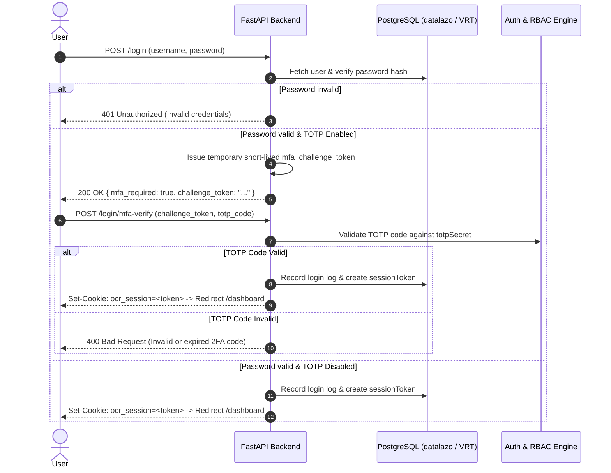

# MFA/TOTP & RBAC Integration Architecture & Plan

This document serves as the permanent technical design specification for introducing **Multi-Factor Authentication (MFA/TOTP)** and **Role-Based Access Control (RBAC)** to **VRTServices**.

---

## 1. Technical Overview

### Multi-Factor Authentication (MFA / TOTP)
- Standard TOTP implementation compatible with Google Authenticator, Authy, 1Password, and Microsoft Authenticator using RFC 6238.
- Two-step authentication flow during login: Password validation $\rightarrow$ 2FA challenge verification.
- User profile MFA management: Setup modal with QR code, secret key manual entry, 6-digit verification test, and one-time emergency backup recovery codes.
- Enforcement policies: Optional per-user activation or mandatory MFA enforcement per Role/Parent Organization.

### Role-Based Access Control (RBAC)
- Fine-grained permission model with predefined roles:
  - `SUPER_ADMIN`: Full system access across all parent entities, multi-tenant databases, system management tools, email logs, and customer deletion.
  - `ADMIN`: Full access to assigned parent entity, client accounts, user management, QBO integrations, transaction editing, and compliance management.
  - `STAFF` / `MANAGER`: Operational access to process check images, run OCR extraction, manage compliance schedules, view/edit transactions; restricted from tenant deletion, billing settings, and user administration.
  - `READ_ONLY` / `VIEWER`: Read-only access to dashboards, storage files, compliance status, and reports; prohibited from creating, updating, or deleting any data.
- FastAPI dependency decorators (`@require_role(...)`, `@require_permission(...)`) protecting every backend route.
- Context-aware UI component rendering based on user role and permissions.

---

## 2. Sequence Architecture



---

## 3. Database Schema Migration

### `"ClientUser"` Table (PostgreSQL `datalazo` database)
The following columns will be added to `"ClientUser"` using non-destructive `ALTER TABLE` statements:

```sql
-- Role-Based Access Control
ALTER TABLE "ClientUser" ADD COLUMN IF NOT EXISTS "role" TEXT NOT NULL DEFAULT 'ADMIN';
ALTER TABLE "ClientUser" ADD COLUMN IF NOT EXISTS "permissions" JSONB DEFAULT '[]'::jsonb;

-- Multi-Factor Authentication (TOTP)
ALTER TABLE "ClientUser" ADD COLUMN IF NOT EXISTS "totpSecret" TEXT;
ALTER TABLE "ClientUser" ADD COLUMN IF NOT EXISTS "totpEnabled" BOOLEAN NOT NULL DEFAULT FALSE;
ALTER TABLE "ClientUser" ADD COLUMN IF NOT EXISTS "totpEnforced" BOOLEAN NOT NULL DEFAULT FALSE;
ALTER TABLE "ClientUser" ADD COLUMN IF NOT EXISTS "totpBackupCodes" JSONB DEFAULT '[]'::jsonb;
ALTER TABLE "ClientUser" ADD COLUMN IF NOT EXISTS "totpConfiguredAt" TIMESTAMP WITH TIME ZONE;
```

---

## 4. Component Implementation Map

### A. Python Dependencies (`requirements.txt`)
- Add `pyotp>=2.9.0` for TOTP generation and validation.
- Add `qrcode[pil]>=7.4.2` for generating authenticator QR code SVG/PNG images.

### B. Core Backend Modules (`app.py`)

1. **Database Schema Auto-Migration**:
   - Update startup initialization functions (`init_qbo_db` / schema check) to run schema migrations for `"ClientUser"`.

2. **RBAC Infrastructure**:
   - Define User Role Enums: `SUPER_ADMIN`, `ADMIN`, `STAFF`, `READ_ONLY`.
   - Define Permission Constants:
     - `PERM_MANAGE_USERS`: Create, update, delete client users.
     - `PERM_DELETE_CUSTOMER`: Delete customer accounts and operational data.
     - `PERM_MANAGE_QBO`: Connect, disconnect, or sync QuickBooks Online.
     - `PERM_EDIT_TRANSACTIONS`: Edit, match, or update GL codes and transactions.
     - `PERM_VIEW_REPORTS`: Access dashboards, financial reports, compliance tracking.
   - Implement FastAPI dependency helpers:
     - `get_current_user_with_role(request)`: Returns user dict containing active role and permission array.
     - `require_role(*allowed_roles)`: Enforces role checks on routes (raises 403 Forbidden if user role is unauthorized).
     - `require_permission(permission)`: Enforces fine-grained permission checks.

3. **MFA / TOTP Engine**:
   - Implement TOTP utilities:
     - `generate_totp_secret()`: Generates standard base32 secret key.
     - `get_totp_provisioning_uri(username, secret)`: Generates `otpauth://` URI string for QR code generation.
     - `verify_totp_code(secret, code)`: Validates 6-digit code with window tolerance ($\pm 1$ time step).
     - `generate_backup_codes()`: Generates 8 single-use 8-character recovery codes.
     - `verify_backup_code(user_id, code)`: Validates and consumes single-use backup code.

4. **Login Flow Refactoring**:
   - Refactor `@app.post("/login")`:
     - Validate password.
     - If `totpEnabled == True`, return 2FA challenge response rendered in `login.html` instead of setting `ocr_session` cookie immediately.
   - Add `@app.post("/login/mfa-verify")`:
     - Validates challenge token and submitted 6-digit TOTP code or backup code.
     - Upon success, issues full `ocr_session` cookie and records login log.

5. **MFA Setup & Profile API Endpoints**:
   - `GET /api/user/mfa/setup`: Generates temporary secret & QR code SVG data URL for authenticator setup.
   - `POST /api/user/mfa/enable`: Verifies initial 6-digit test code, enables MFA, and returns printable recovery codes.
   - `POST /api/user/mfa/disable`: Disables MFA (requires current password + TOTP confirmation).
   - `POST /api/user/mfa/regenerate-backup-codes`: Generates a fresh set of emergency recovery codes.

6. **Route Protection Enforcement (RBAC Audit)**:
   - Protect Administrative API routes with `@require_role("SUPER_ADMIN", "ADMIN")`:
     - `DELETE /api/customers/{customer_id}`
     - `POST /api/tax-team`
     - `POST /api/admin/...`
     - User administration endpoints.
   - Protect Read-Only restrictions across mutation routes (`POST`, `PUT`, `DELETE`).

### C. User Interface & Templates

1. **`templates/login.html`**:
   - Add 2FA challenge view container (smooth sliding step transition after password verification).
   - 6-digit numeric input with auto-focus, paste handling, and single-use backup code option.

2. **`templates/dashboard.html`**:
   - **Profile / Security Settings Modal**:
     - MFA Status badge (Enabled / Disabled).
     - Setup MFA workflow with QR code modal step.
     - Backup codes printable download card.
   - **RBAC UI Adaptation**:
     - Inject active user role into Jinja template context (`user_role`).
     - Conditionally render or hide administrative buttons (e.g. Delete Customer button, QBO reconnect buttons, User Management nav item) based on role.

---

## 5. Testing & Verification

1. **Unit & Integration Tests**:
   - Verify secret generation, URI formatting, and TOTP verification logic.
   - Test single-step login (MFA disabled) vs. two-step challenge login (MFA enabled).
   - Verify 403 Forbidden enforcement on protected routes when accessed by `READ_ONLY` or `STAFF` roles.
2. **Mobile Authenticator Integration**:
   - Scan generated QR code using Google Authenticator / Authy on smartphone.
   - Confirm time window synchronization and successful challenge completion.
3. **Backup Code Validation**:
   - Log in using single-use backup recovery code and verify immediate invalidation after use.
